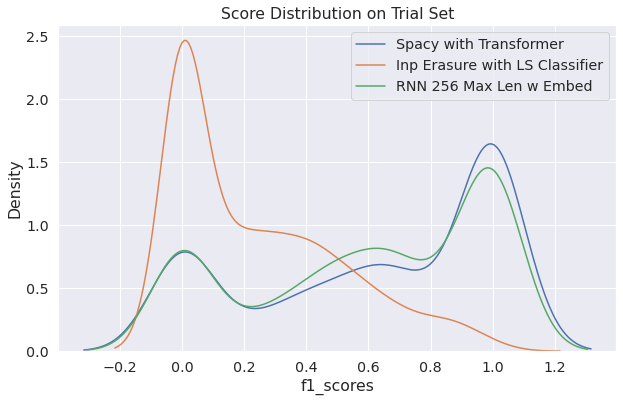

# toxic-spans-detection-SemEval2021

This notebook was my submission for the SemEval2021 competition, particularly for the Task 5: [Toxic Spans Detection](https://competitions.codalab.org/competitions/25623). 

The task is to identify toxic words or phrases (spans) inside a given sentence. My approaches on tackling the task were:

* **Input Eraser**: Since all sentences in the original dataset contained toxic spans, for this task I had to enrich the dataset with sentences which are non toxic. I found non toxic sentences in https://github.com/t-davidson/hate-speech-and-offensive-language. Using `Doc2Vec` in order to retrieve a single vector embedding for each sentence, the sentences are initially classified as toxic or non toxic. Then, words are removed iteratively and the same sentences are classified again. When the probability of belonging to the toxic class falls below a particular threshold (hyperparameter), the word which was removed is classified as toxic.

* **RNN**: Recurrent Neural Networks are a standard approach when it comes to NLP Tasks. For this task, I used the baseline model implemented by Dr. Pavlopoulos ([original repo](https://github.com/ipavlopoulos/toxic_spans)) which I forked and enhanced by introducing the use of pretrained embeddings ([my fork](https://github.com/iliasKatsabalos/toxic_spans/commits/pretrained_embeddings)). It uses a single Keras Bidirectional LSTM with a TimeDistributed output for classifying each word as toxic or non-toxic.

* **spaCy**: [spaCy](https://spacy.io/) uses Convolutional Neural Networks instead of Recurrent Neural Networks. After preproecessing the input sentences so that they are compatible as inputs to spaCy, I used the Named Entity Recognition module through Command Line Interface. Apart from the CNN architecture, I also used transformers which were recently introduced by spaCy at that time.

## Performance

In terms of performance on the trial set, the Input Eraser showcased the worse f1 scores. Then performance jumped when RNNs were used. However, spaCy's NER module with transformers was able to outperform all other approaches.

